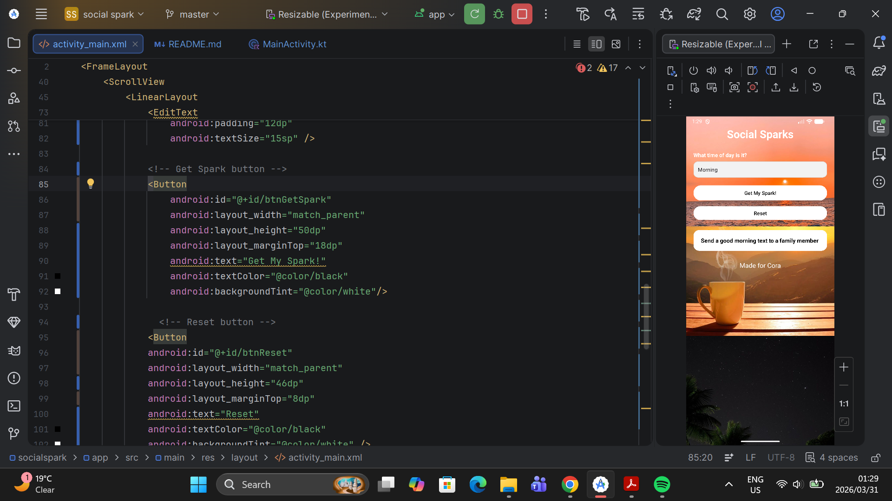

**Social Sparks**
This is our IMAD5112 assignment app that we built for a friend called Cora.
The app suggests small social actions based on the time of day.

**Design Considerations**
-we used a simple LinearLayout so the screen is easy to read
-custom background images adds  warm and friendly feel to the screen"
-we used an EditText for input so the user can type any time of day
-The result appears in a TextView styled as a card at the bottom
-A Reset button allows the user to clear everything and start again
-Error handling shows a Toast message for empty or invalid input

**How to run the app**
.Open Android Studio
.Clone or download this project
.Wait for Gradle to sync
.Click the Run button or press Shift and F10
.Choose an emulator or connect your phone

**Times you can enter**
-Morning - sends a good morning text to family
-Mid-morning - sends a thank you to a colleague
-Afternoon - shares a meme with a friend
-Snack - sends a thinking of you message
-Dinner - calls someone for a catch up  
-Night - leaves a comment on a friends post

**GitHub and Version Control**
we used GitHub to store and track my code throughout the project.
we made regular commits after completing each feature so there is
a clear history of my progress.

**Screenshots**t.
The main screen has a text input, two buttons, and a result card
that shows the social spark suggestion.

**Video Presentation**
link to video https://youtube.com/shorts/LuH5iDtq8WY?si=mfA6bQ4zkDDb2jvP

**Names**
Onalenna Ntlabathi
Maloka Thakgalang
Donald Mudzani

**References**

Android Developer Documentation, 2026.Activity. [online] Available at:
<https://developer.android.com/reference/android/app/Activity>
[Accessed 27 March 2026].

Android Developer Documentation, 2026.Toasts overview. [online] Available at:
<https://developer.android.com/guide/topics/ui/notifiers/toasts>
[Accessed 27 March 2026].

Android Developer Documentation, 2026.View. [online] Available at:
<https://developer.android.com/reference/android/view/View>
[Accessed 27 March 2026].

JetBrains, 2026.Kotlin for Android. [online] Available at:
<https://kotlinlang.org/docs/android-overview.html>
[Accessed 27 March 2026].

